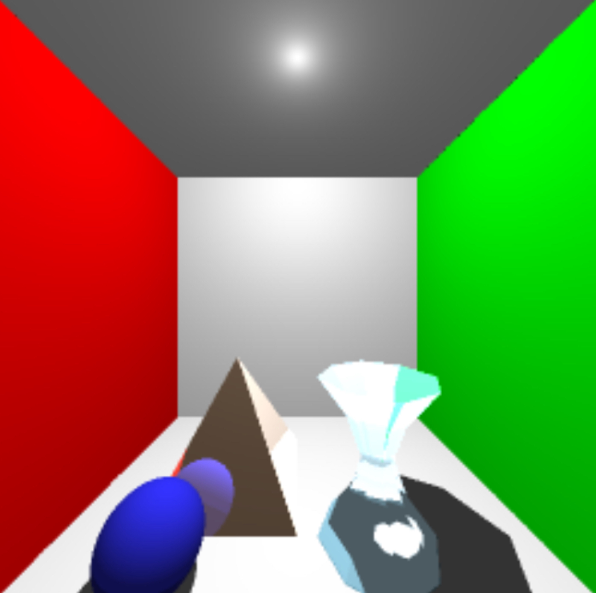

# Ray-Tracing

A simple Cornell Box with 

one primitive object,  
one polygonal shape,  
and a complex surface mesh  

was rendered.

All three ray tracing features (Shadows, Reflection, and Refraction) were implemented.

The result is as below:  

 
